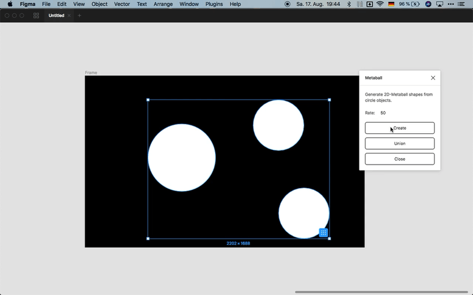

# Metaball

Metaball plugin generates 2D-Metaball shapes from circle objects.

How to use:
1. Draw some circles and select them
2. Right Click -> Plugins -> Metaball
3. Click on button "Create"

This project is based on Metaball script by SATO Hiroyuki (http://shspage.com/aijs/en/#metaball).

# Compile with Webpack
The main plugin code is in `src/code.ts`. The HTML for the UI is in `src/ui.html`, while the embedded JavaScript is in `src/ui.ts`.

These are compiled to files in `dist/`, which are what Figma will use to run your plugin.

To build:

    $ npm install
    $ npx webpack

For more info, see: https://www.figma.com/plugin-docs/bundling-webpack/